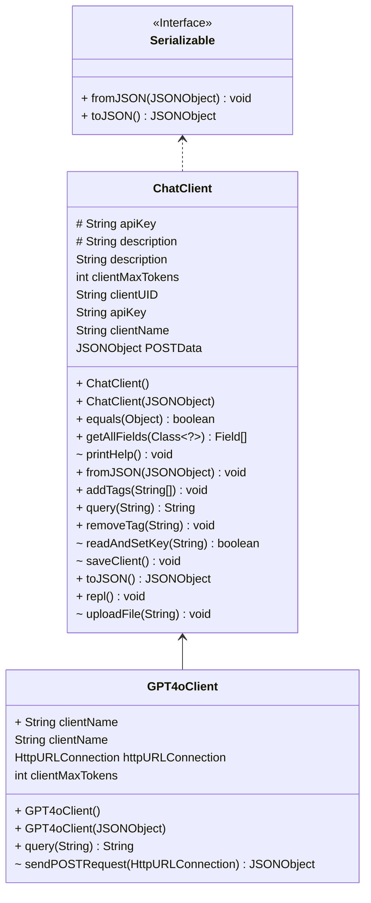

# PA1 - LLM ChatManager

Recently the LLM (Large Language Model) has become amazingly powerful and popular in the world. Several companies have
deployed their LLM chat services, such as ChatGPT from OpenAI. In this programming assignment, you are going to
implement a simple local chat manager (the `ChatManager` class) that can interact with different LLM chat clients (the
`ChatClient` class) and persist chat sessions.

## Change Log

:warning: Please check regularly for any updates from the skeleton repo. :warning:

- PA0:
    - Initial release, implement the basic functionalities of `ChatManager`, `ChatClient`, and `GPT4oClient` class,
    - design Task1 test cases
- PA1:
    - `ChatManager`: refine REPL, add several commands (tag, untag, desc, history)
    - `ChatClient`: add persistence functionalities, add tag and description, add token statistics in Message
    - Add Interface `Serializable` for `ChatClient` and `Message(s)`
    - Add four annotations for guiding persistence
    - Add Task2 test cases
    - Code refactoring and bug fixing

## Grading

In PA1, you need to implement two tasks, detailed implementation can be searched with "TODO" in the codebase.

- (Done at PA0) Task 1: Implement `ChatManager` class and `ChatClient` class, implement the `query(String prompt)`
  method in `GPT4oChatClient` class.
- Task 2: Implement the persistence interface (`fromJson` and `toJson` in `Serializable`) in the `ChatManager` class and
  `ChatClient` class. You should implement two annotations (`JsonRangeCheck` and `JsonSecret`) and apply those annotations for guiding persistence.
- You are free to use provided helper methods in the `Utils` class, or implement your own methods.

We will provide public test cases for you to verify the correctness of your implementations. However, passing all the
public test cases does not mean that you can obtain the full mark for the PA. We also have many additional test cases as
the hidden ones, which are different from the ones we provided in the skeleton.

| Item                                            | Ratio | Notes                                                                              |
|-------------------------------------------------|-------|------------------------------------------------------------------------------------|
| Having at least three commits on different days | 5%    | You should commit three times during different days in your repository             |
| Code style                                      | 5%    | You get 5% by default, and every 5 warnings from CheckStyle deducts 1%.            |
| Task 1 Public test cases                        | 15%   | Based on the Result of GitHub Classroom (# of passing tests / # of provided tests) |
| Task 1 Private test cases                       | 15%   | Based on TA evaluation (# of passing tests / # of provided tests)                  |
| Task 1 Bonus                                    | 5%    | Based on TA evaluation                                                             |
| Task 2 Public test cases                        | 30%   | Based on the Result of GitHub Classroom (# of passing tests / # of provided tests) |
| Task 2 Private test cases                       | 30%   | Based on TA evaluation (# of passing tests / # of provided tests)                  |

## Test

### Generate an API Key

To run/test the application, you need to get an API key from the LLM service provider. Below we list some useful
platforms for you to get the API key:

- (Recommended) GPT-4o: https://itso.hkust.edu.hk/services/it-infrastructure/azure-openai-api-service
- (Bonus) Deepseek: https://platform.deepseek.com/api_keys
- (Bonus) Grok: https://docs.x.ai/docs/overview

To pass the test when using GitHub Action, you can either hardcode your API key in the code when creating new
`ChatClient` instance or write a script (for example: `echo xxx > keys/GPT-4o.txt`) to be called before each
`setup-command: ''` in [GitHub Actions Workflow](./.github/workflows/classroom.yml).

### Demo

It's recommended to run and test with IntelliJ IDEA and OpenJDK 17. The project is written as a command line
Read-Eval-Print loop (REPL), you can run the application with the following command (or IDE-integrated application
runner) to
play with it:

```bash
# play with the repl
./gradlew run
```

Here's a screencast of the application running (Task 1):

[](https://asciinema.org/a/kBYt3kYUAW5j0Z18hfzBvn0EM)

Here's another screencast of the application running with persistence functionality (Task 2):

[](https://asciinema.org/a/2mMlSA5b43pMownkq0WIoEeJ8)

We use JUnit5 test to validate the correctness of individual methods that you need to implement, the specific test
commands and their corresponding task is given below:

```bash
# run all public tests
./gradlew test
# check coding style
./gradlew checkstyleMain
```

### Task1

To run Task1 public tests:

```bash
./gradlew test --tests "hk.ust.cse.comp3021.Task1Test"
```

The public test cases and their corresponding code are given below:

| Test Name                   | Score | Related Methods/Classes                                      |
|-----------------------------|-------|--------------------------------------------------------------|
| showChatClients             | 3%    | `ChatManager.showChatClients`                                |
| getChatClient               | 3%    | `ChatManager.getChatClient` and `InvalidClientNameException` |
| replChatClient              | 3%    | `GPT4oClient`                                                |
| replChatClientConversation1 | 3%    | `GPT4oClient`                                                |
| replChatClientConversation2 | 3%    | `GPT4oClient`                                                |
| Private Test Cases          | 15%   | The file upload feature in `ChatClient.repl`                 |
| Bonus Test Cases            | 5%    | Implement another ChatClient than `GPT4oClient`              |

### Task2

To run Task1 public tests:

```bash
./gradlew test --tests "hk.ust.cse.comp3021.Task1Test"
```

The public test cases and their corresponding code are given below:

| Test Name                     | Score | Related Classes/Methods/Fields                                                                                                               |
|-------------------------------|-------|----------------------------------------------------------------------------------------------------------------------------------------------|
| serialization                 | 3%    | `ChatClient.toJson`                                                                                                                          |
| deserialization               | 3%    | `ChatClient.fromJson`, `PersistenceException`                                                                                                |
| persistenceRoundTrip          | 3%    | `ChatClient.toJson`, `ChatClient.fromJson`                                                                                                   |
| jsonCheckDeserialization      | 3%    | `ChatClient.fromJson` and fields: `clientName`, `maxTokens`, `apiURL`                                                                        |
| jsonFilterSerialization       | 3%    | `ChatClient.toJson` and fields: `tags`, `description`                                                                                        |
| jsonFilterDeserialization     | 3%    | `ChatClient.fromJson` and fields: `tags`, `description`                                                                                      |
| jsonIgnoreSerialization       | 3%    | `ChatClient.toJson` and fields: `systemPrompt`, `replPrompt`, `menus`                                                                        |
| jsonIgnoreDeserialization     | 3%    | `ChatClient.fromJson` and fields: `systemPrompt`, `replPrompt`, `menus`                                                                      |
| jsonRangeCheckDeserialization | 3%    | `ChatClient.fromJson` and fields: `timeCreated`, `timeLastOpen`, `timeLastExit`, `totalPromptTokens`, `totalCompletionTokens`, `temperature` |
| jsonSecretDeserialization     | 3%    | `ChatClient.fromJson` and field: `apiKey`                                                                                                    |
| Private Test Cases            | 15%   | the same scope of public test cases but focus more on edge cases and implementation details as shown below                                   |

We have five annotations and their corresponding exceptions are given below:

| Annotation Name   | Exception Name            | Description                                                                   |
|-------------------|---------------------------|-------------------------------------------------------------------------------|
| `@JsonCheck`      | `JsonCheckException`      | Check the field value with a regular expression, throw exception if not match |
| `@JsonFilter`     | `JsonFilterException`     | Filter out the prohibited contents or replace with '*'                        |
| `@JsonIgnore`     | No exception              | Ignore the fields in the serialized JSON                                      |
| `@JsonRangeCheck` | `JsonRangeCheckException` | Check the range of the field value, throw exception if not in the range       |
| `@JsonSecret`     | `JsonSecretException`     | Encrypt the field value in the serialized JSON                                |

### Private Test Cases

More specifically, the **private** test cases will test whether you implement the annotation in a generic way. For
example, you should not hardcode the field names and deal with the annotation, but use reflection to get the field types
and values and perform corresponding annotation actions. In the private test, we might add some unprecedented fields in
`ChatClient` and `Message` to test your implementation.

## Project Structure

:warning: Do not modify the project structure! :warning:

The project structure is as follows:

- `ChatManager` manages all `ChatClient`s, `repl()` is the entry point for the command-line REPL (outer REPL).
- `ChatClient` contains common implementation and specifies abstract methods, `repl()` is the entry point for the chat
  REPL (inner REPL).
    - `GPT4oClient` is a concrete class that extends `ChatClient`, `query()` is used for interacting with the API
      Service
- `Message` and `Messages` are used for storing chat messages.
- `Utils` contains some utility functions.
- `Serializable` is an interface for serialization and deserialization, implemented by `ChatClient` and `Message(s)`.
- `annotations/` contains annotations for guiding persistence.
- `exceptions/` contains exceptions corresponding to the annotations, four of them are inherited from
  `PersistenceException`.
- `sessions/` contains the serialized JSON files for persistence, TA has provided a sample JSON file at
  `src/test/resources/GPT-4o_2025-03-09_23-52-13.json`
- `keys/` contains the API keys for different chat clients, in task 2 we only use GPT-4o.



Without changing the above structure, you can implement any helper methods or classes you need.

## Submission Policy

PA submission is similar to lab submission, both use GitHub Classroom as demonstrated
in [lab1](https://hkustconnect-my.sharepoint.com/:p:/g/personal/xchenht_connect_ust_hk/EXr8FR9l1ytKh4LFdQceHDYB9gO-hAc4f-GAYyb0jp7LBA?e=KdDj78).
Please modify and commit to your own repo. Each commit will trigger a Github Action for autograding, and you can check
the your public score in latest GitHub Action.

:heavy_exclamation_mark: Do not share your code with others. :heavy_exclamation_mark:

## Academic Integrity

We trust that you are familiar with the Honor Code of HKUST. If not, refer
to [this page](https://course.cse.ust.hk/comp3021/#policy).

### Credit

- The project use [org.json](http://stleary.github.io/JSON-java/index.html) as the low-level JSON library for
  serialization and deserialization.
- Some annotations design is inspired by [Jackson](https://github.com/FasterXML/jackson-annotations)
- The test dataset is generated by [JsonFormer](https://github.com/1rgs/jsonformer)

## Contact

If you have any questions, please email TA Xiang Chen via xchenht@connect.ust.hk
